# Sterling B2B Integrator to Azure Migration - Architecture Diagrams

This document contains editable architecture diagrams in Mermaid format. These can be viewed directly on GitHub and edited in any text editor.

---

## 🔄 High-Level Migration Architecture

---

## ⚡ Logic App Workflow Architecture

```mermaid
flowchart TB
    subgraph WORKFLOW["Logic App: edi-transform-la-dev"]
        direction TB
        
        TRIGGER[["🔵 HTTP Trigger<br>POST /edi-transform"]]
        
        TRIGGER --> INIT["Initialize Variables<br>• messageId<br>• processingStatus<br>• timestamp"]
        
        INIT --> SWITCH{"🔀 Switch on<br>X-Transaction-Type<br>Header"}
        
        SWITCH -->|"837"| T837["Transform 837<br>(Healthcare Claim)"]
        SWITCH -->|"835"| T835["Transform 835<br>(Remittance Advice)"]
        SWITCH -->|"270"| T270["Transform 270<br>(Eligibility Inquiry)"]
        SWITCH -->|"271"| T271["Transform 271<br>(Eligibility Response)"]
        SWITCH -->|"default"| ERROR["❌ Bad Request<br>400 Response"]
        
        T837 --> R837["✅ Response 837<br>JSON Output"]
        T835 --> R835["✅ Response 835<br>JSON Output"]
        T270 --> R270["✅ Response 270<br>JSON Output"]
        T271 --> R271["✅ Response 271<br>JSON Output"]
    end
    
    subgraph IA["Integration Account"]
        SCHEMA837[["📄 X12-837-Claim"]]
        SCHEMA835[["📄 X12-835-Remittance"]]
        SCHEMA270[["📄 X12-270-Eligibility"]]
        SCHEMA271[["📄 X12-271-Response"]]
        MAP837[["🔄 837-to-json.xslt"]]
        MAP835[["🔄 835-to-json.xslt"]]
        MAP270[["🔄 270-to-json.xslt"]]
        MAP271[["🔄 271-to-json.xslt"]]
    end
    
    T837 -.-> MAP837
    T835 -.-> MAP835
    T270 -.-> MAP270
    T271 -.-> MAP271
    
    style WORKFLOW fill:#f3e5f5,stroke:#9c27b0,stroke-width:2px
    style IA fill:#e3f2fd,stroke:#2196f3,stroke-width:2px
    style TRIGGER fill:#bbdefb,stroke:#1976d2
    style SWITCH fill:#fff9c4,stroke:#fbc02d
    style ERROR fill:#ffcdd2,stroke:#e53935
```

---

## 🔗 End-to-End Data Flow

---

## 🏗️ Infrastructure Components

```mermaid
graph TB
    subgraph AZURE["☁️ Microsoft Azure"]
        subgraph RG["📦 Resource Group: rg-edi-transform-dev"]
            subgraph INTEGRATION["Integration Layer"]
                IA[("🔗 Integration Account<br>Standard Tier<br>$1,000/mo")]
                LA[("⚡ Logic App<br>Consumption<br>~$50/mo")]
            end
            
            subgraph STORAGE["Storage Layer"]
                BLOB[("📁 Blob Storage<br>Hot Tier<br>$23/TB/mo")]
                SB[("📨 Service Bus<br>Standard<br>$10/mo")]
            end
            
            subgraph MONITORING["Monitoring Layer"]
                EH[("📊 Event Hub<br>Standard<br>$11/mo")]
                LAW[("📋 Log Analytics<br>Workspace<br>$2.30/GB")]
                AI[("🔍 App Insights<br>Connected")]
            end
            
            subgraph SECURITY["Security Layer"]
                KV[("🔐 Key Vault<br>Standard<br>$0.03/10k ops")]
            end
        end
    end
    
    subgraph EXTERNAL["External Systems"]
        TP1["🏢 Payer Systems<br>(BCBS, Aetna, UHC)"]
        TP2["☁️ Clearing Houses<br>(Change HC, Availity)"]
        IS["🏥 Internal Systems<br>(EHR, Billing)"]
        SPLUNK["📈 Splunk Enterprise"]
    end
    
    TP1 & TP2 <-->|"HTTPS/AS2"| LA
    LA <-->|"Internal API"| IS
    LA --> IA
    LA --> BLOB
    LA --> SB
    LA --> EH
    LA --> KV
    EH --> LAW
    LAW --> AI
    EH -->|"HEC/REST"| SPLUNK
    
    style AZURE fill:#e3f2fd,stroke:#1565c0,stroke-width:3px
    style RG fill:#fff,stroke:#42a5f5,stroke-width:2px
    style INTEGRATION fill:#f3e5f5,stroke:#7b1fa2
    style STORAGE fill:#e8f5e9,stroke:#388e3c
    style MONITORING fill:#fff3e0,stroke:#f57c00
    style SECURITY fill:#fce4ec,stroke:#c2185b
    style EXTERNAL fill:#f5f5f5,stroke:#9e9e9e
```

---

## 📊 Component Mapping: Sterling vs Azure

---

## 🔒 Security Architecture

```mermaid
flowchart TB
    subgraph NETWORK["Network Security"]
        direction LR
        VNET["🌐 Virtual Network"]
        NSG["🛡️ Network Security Group"]
        PEP["🔒 Private Endpoints"]
    end
    
    subgraph IDENTITY["Identity & Access"]
        direction LR
        AAD["👤 Azure AD"]
        MSI["🔐 Managed Identity"]
        RBAC["📋 RBAC Roles"]
    end
    
    subgraph SECRETS["Secrets Management"]
        direction LR
        KV["🔑 Key Vault"]
        CERTS["📜 Certificates"]
        KEYS["🔐 API Keys"]
    end
    
    subgraph COMPLIANCE["Compliance"]
        direction LR
        HIPAA["🏥 HIPAA"]
        AUDIT["📊 Audit Logs"]
        ENCRYPT["🔒 Encryption at Rest"]
    end
    
    LA[("⚡ Logic App")] --> NETWORK
    LA --> IDENTITY
    LA --> SECRETS
    LA --> COMPLIANCE
    
    MSI --> KV
    AAD --> RBAC
    KV --> LA
    
    style NETWORK fill:#e3f2fd,stroke:#1976d2
    style IDENTITY fill:#fce4ec,stroke:#c2185b
    style SECRETS fill:#fff8e1,stroke:#ffa000
    style COMPLIANCE fill:#e8f5e9,stroke:#388e3c
```

---

## 📝 How to Edit These Diagrams

### Option 1: Edit in GitHub
1. Click the **Edit** button on this file in GitHub
2. Modify the Mermaid code directly
3. Preview changes using GitHub's built-in Mermaid renderer
4. Commit your changes

### Option 2: Edit in VS Code
1. Install the **Markdown Preview Mermaid Support** extension
2. Open this file in VS Code
3. Use Ctrl+Shift+V to preview
4. Edit the Mermaid code blocks

### Option 3: Use Mermaid Live Editor
1. Go to [mermaid.live](https://mermaid.live)
2. Copy a diagram's code block
3. Edit visually
4. Copy back the updated code

### Option 4: Use draw.io (for complex diagrams)
Open `architecture-diagram.drawio` in:
- [diagrams.net](https://app.diagrams.net) (web-based)
- VS Code with Draw.io Integration extension
- Desktop Draw.io application

---

## 📁 Related Files

| File | Description |
|------|-------------|
| `architecture-diagram.drawio` | Full editable diagram with Azure icons (open in diagrams.net) |
| `architecture-diagram.html` | Self-contained HTML/SVG version (view in browser) |
| `MIGRATION-GUIDE.md` | Complete migration documentation |

---

*Last Updated: February 2026*

